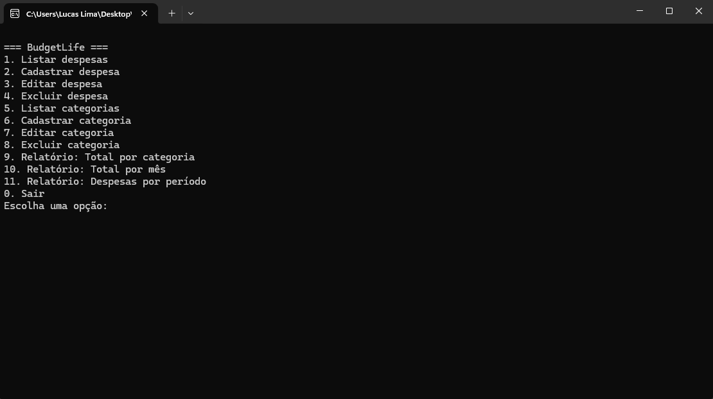
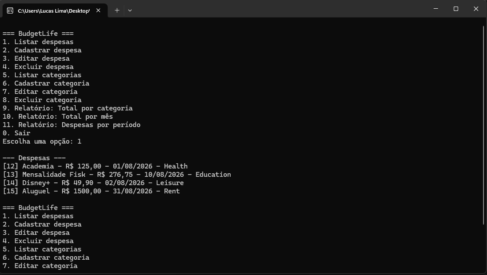
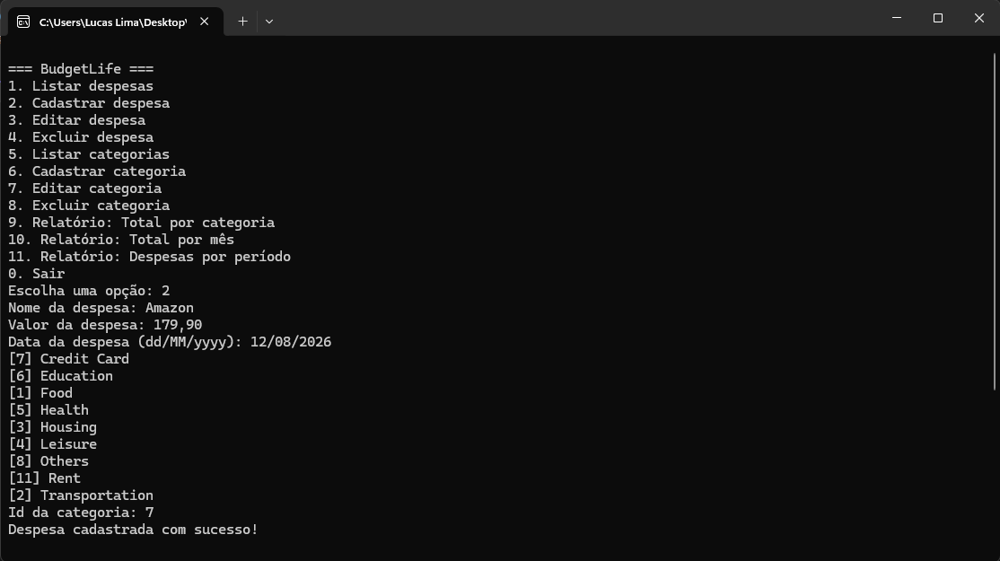
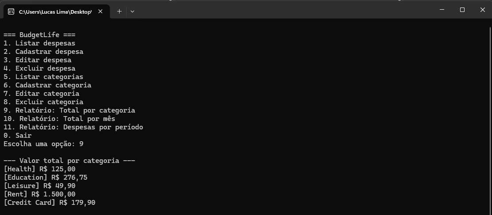
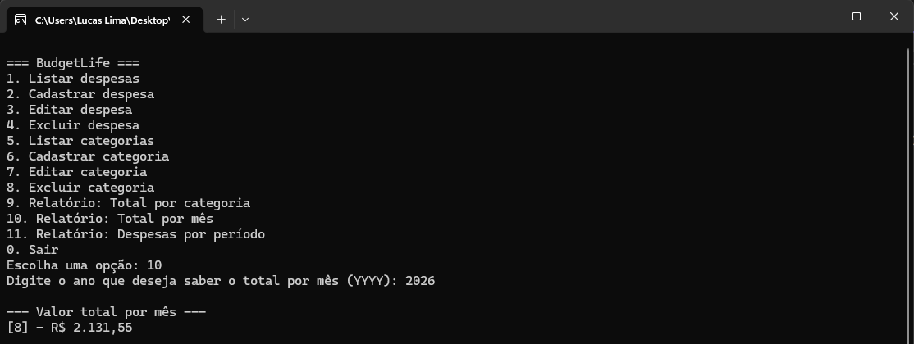
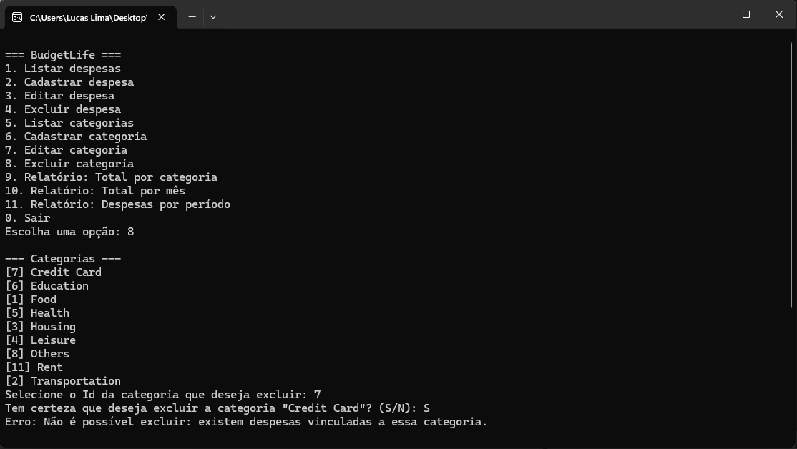

# BudgetLife

Aplicação de controle de despesas pessoais em Console, desenvolvida em C# (.NET 8) com MySQL — criada como projeto de estudo para praticar POO, Clean Code, SOLID, Design Patterns e SQL.

## Objetivo

Este projeto foi desenvolvido com foco em aprendizado, aplicando na prática conceitos de:

- **Programação Orientada a Objetos (POO)**
- **Clean Code** — Nomes claros, responsabilidades bem definidas
- **Princípios SOLID** — Especialmente Inversão de Dependência (via interfaces) e Responsabilidade Única
- **Design Patterns** — Repository Pattern
- **SQL** — Modelagem relacional, queries com `JOIN`, `GROUP BY` e `SUM` para relatórios agregados

Mais do que um simples CRUD, o BudgetLife foi pensado para consolidar boas práticas de arquitetura em camadas (Model → Repository → Service → UI), simulando decisões que também aparecem em projetos profissionais.

## Tecnologias

- **C# / .NET 8** — Console Application
- **MySQL** — Banco de dados relacional, acessado via MySqlConnector

## Arquitetura

O projeto segue uma arquitetura em camadas, separando responsabilidades e aplicando os princípios de SOLID:

```
BudgetLife/
├── Database/       # scripts SQL (schema e seed)
├── Models/         # entidades e objetos de retorno (Category, Expense, CategoryTotal, MonthlyTotal)
├── Repositories/    # acesso a dados (CRUD e consultas via MySqlConnector)
├── Services/         # regras de negócio e validações
├── UI/               # menu de console, interação com o usuário
├── docs/             # documentação de testes
└── Program.cs       # composição das dependências e ponto de entrada
```

**Fluxo de dependências:** `UI → Services → Repositories → Database`

## Funcionalidades

### Despesas
- Cadastrar, listar, editar e excluir despesas
- Exclusão com confirmação (S/N)

### Categorias
- Cadastrar, listar, editar e excluir categorias
- Exclusão com confirmação (S/N)
- Exclusão bloqueada quando há despesas vinculadas à categoria

### Relatórios
- Total de gastos por categoria
- Total de gastos por mês (filtrado por ano)
- Despesas dentro de um período específico

## Como rodar o projeto

### Pré-requisitos
- .NET 8 SDK
- MySQL instalado e rodando

### Passo a passo

1. Clone o repositório:
```
   git clone https://github.com/lima1301lucas/BudgetLife.git
```

2. Crie o banco de dados executando os scripts em `Database/`:
   - `schema.sql` — cria as tabelas `categories` e `expenses`
   - `seed.sql` — insere as categorias iniciais

3. Configure a conexão com o banco:
   - Copie `appsettings.example.json` para `appsettings.json`
   - Preencha com suas credenciais do MySQL

4. Rode o projeto:
```
   dotnet run
```

## Demonstração

### Menu principal


### Listagem de despesas


### Cadastro de despesa


### Relatório: total por categoria


### Relatório: total por mês


### Validação de dados


## Testes

Foram realizados testes manuais end-to-end, cobrindo o fluxo completo da aplicação (cadastro, edição, exclusão, relatórios e validações). Documentação completa em [`docs/TESTING.md`](docs/TESTING.md).

## Possíveis melhorias futuras

- Testes automatizados (unitários e de integração)
- Exportação de relatórios (CSV)
- Interface gráfica no lugar do console
- Autenticação/múltiplos usuários
